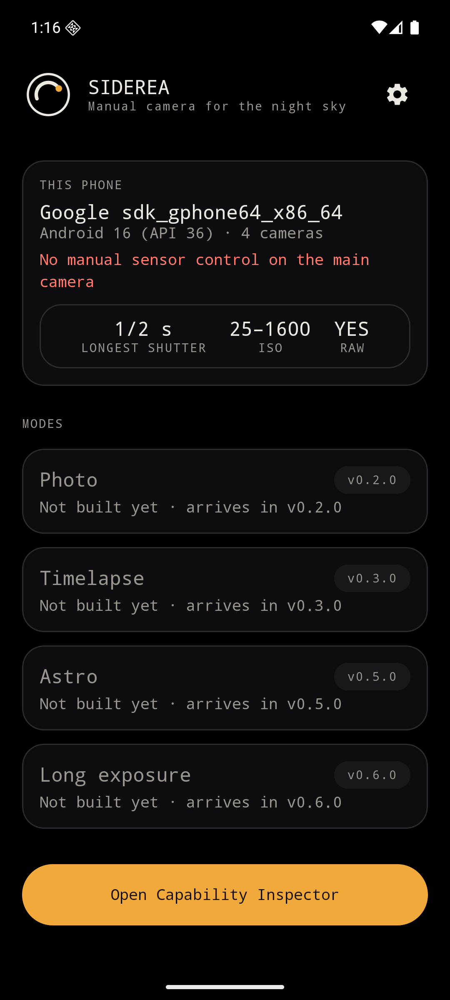
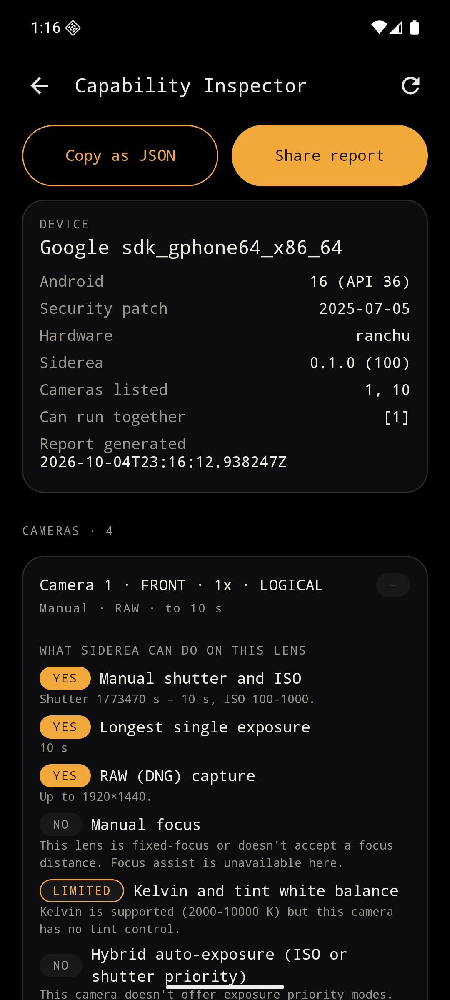
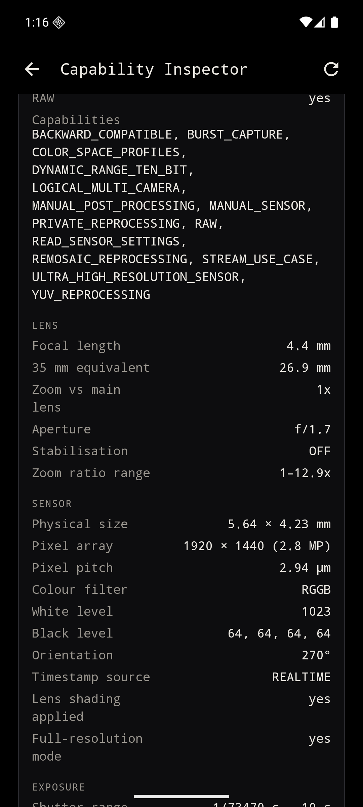
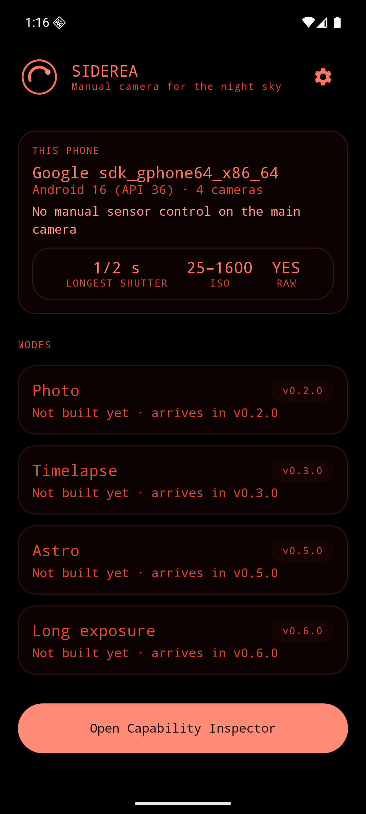

<p align="center">
  <picture>
    <source media="(prefers-color-scheme: dark)" srcset="branding/wordmark.svg">
    
  </picture>
</p>

<p align="center">
  A manual camera, long-exposure timelapse and astro app for Android.<br>
  Full sensor control, built from what your phone's cameras actually report.
</p>

<p align="center">
  <a href="https://github.com/Mr-Dark-debug/siderea/actions/workflows/ci.yml"></a>
  <a href="https://github.com/Mr-Dark-debug/siderea/releases/latest"></a>
  <a href="LICENSE"></a>
  
</p>

---

## Status: v0.1.0, early

> **There is no viewfinder yet.** v0.1.0 is Milestone 0: the project skeleton, design system, logo and the
> **Capability Inspector**. It exists so that the next milestones are built on measurements from real phones
> rather than assumptions. It has **only been run on Android emulators**, not on a physical phone.
> If you have an Android phone, the most useful thing you can do is run the Inspector and
> [send the report](#help-wanted-send-a-device-report).

| | Milestone | Release | State |
|---|---|---|---|
| ✅ | **M0** Skeleton, design system, logo, Capability Inspector | v0.1.0 | done (emulator-verified only) |
| ⬜ | **M1** Photo mode: full manual controls, RAW/JPEG, histogram, peaking | v0.2.0 | not started |
| ⬜ | **M2** Timelapse: foreground service, sessions, `session.json`, resume | v0.3.0 | not started |
| ⬜ | **M3** Export: H.264/HEVC, fps, resolution, crop, deflicker | v0.4.0 | not started |
| ⬜ | **M4** Astro: star trails, dark frames, aligned stacking | v0.5.0 | not started |
| ⬜ | **M5** Virtual Bulb long exposure | v0.6.0 | not started |
| ⬜ | **M6** Exposure ramp, polish, accessibility | v1.0.0 | not started |

Details of what works, what is untested on hardware, and known issues per release are in
[CHANGELOG.md](CHANGELOG.md).

## Screenshots

<p align="center">
  
  
  
  
</p>

<sub>Captured on an Android 16 emulator, whose virtual cameras are simpler than a real phone's. Real-device
screenshots will replace these once the Inspector has run on hardware.</sub>

## Why

The stock Pixel camera hides manual control in night and astro shooting, and its timelapse output can't be
tuned. Video-first apps don't do long-exposure stills or astro timelapses. Nothing offers *full manual camera +
long-exposure intervalometer + astro stacking + proper video export* in one clean Android app. Siderea aims to.

## What it is built around

- **Camera2**, not CameraX: direct control of shutter, ISO, frame duration, focus distance, AE / AF / AWB and
  `RAW_SENSOR`, with per-frame `CaptureResult` metadata.
- **Capability-driven UI.** Nothing is hardcoded. The app reads every camera's real exposure range, ISO range,
  focus range, RAW support and output sizes, and shows or disables controls accordingly, always with a
  plain-language explanation ("This lens can't expose longer than 1/2 s. Use Virtual Bulb for longer
  exposures.").
- **Android 16 features, gated twice:** Kelvin + tint white balance and hybrid (ISO / shutter priority)
  auto-exposure are used only when the OS *and* the camera HAL both report them.
- **Night-first design.** True-black background, one amber accent, and a pure-red mode that preserves dark
  adaptation. 56 dp touch targets for cold fingers.

## Capability Inspector (the v0.1.0 feature)

For every camera, including physical sub-cameras behind logical ones: lens facing, focal length and 35 mm
equivalent (`0.5x / 1x / 5x`), aperture, hardware level, capabilities, manual-sensor and RAW flags, shutter /
ISO / frame-duration ranges, focus range and hyperfocal distance, RAW / JPEG / YUV sizes, supported
AE / AWB / AF / noise-reduction modes, Android 16 CCT and hybrid-AE support, and camera extensions.
**Copy as JSON** and **Share report** export it all.

### Inspector output for the maintainer's Pixel

<!-- PLACEHOLDER: replaced once the Inspector has been run on a real Pixel.
     Paste the "Share report" summary here (device, per-lens verdicts), and attach the full JSON
     under docs/device-reports/. -->

*Not yet collected.* The Inspector has not been run on a Pixel. This section is intentionally empty rather than
filled with emulator data.

## Supported devices

- **Android 10 (API 29) or newer.** Built against and targeting Android 17 (API 37).
- What a given phone can do depends on its cameras, not on Siderea. Manual shutter/ISO needs the
  `MANUAL_SENSOR` capability and RAW needs `RAW`; each lens reports them separately, so the Inspector (and
  later the camera UI) shows this per lens.
- Kelvin + tint white balance and hybrid auto-exposure need **Android 16** and a camera HAL that reports them.
- No phone is hardcoded and the Pixel model is detected at runtime. A list of confirmed devices will grow from
  device reports.

## Install

Grab `siderea-v0.1.0-debug-signed.apk` from the [latest release](https://github.com/Mr-Dark-debug/siderea/releases/latest)
and open it on your phone (allow installs from your browser or file manager when prompted). Verify it against
the SHA-256 in the release notes.

> v0.1.0 is **debug-signed** because no release key exists yet. Once a release-signed build is published you
> will need to uninstall the debug-signed one first. See [docs/RELEASING.md](docs/RELEASING.md).

## Build from source

Requirements: **JDK 21**, Android SDK with platform `android-37.0`.

```bash
git clone https://github.com/Mr-Dark-debug/siderea.git
cd siderea
./gradlew assembleDebug                      # → app/build/outputs/apk/debug/
./gradlew qualityCheck testDebugUnitTest lint
./gradlew :app:connectedDebugAndroidTest     # needs an emulator or device
```

Create `local.properties` with `sdk.dir=/path/to/Android/Sdk` if Gradle can't find the SDK.

## Help wanted: send a device report

1. Install the APK and open **Capability Inspector**.
2. Tap **Share report** (or **Copy as JSON**).
3. Open a [Device report](https://github.com/Mr-Dark-debug/siderea/issues/new?template=device_report.yml) issue and
   attach it. The report contains your phone model, Android version and camera capabilities, with no photos,
   location or accounts.

## Project layout

```
app/                  single-activity app: navigation, Hilt wiring, screens
core/ui               design system (theme, tokens, components)
core/camera           Camera2 capability reader, verdicts, JSON report
core/data             settings (DataStore)
core/capture          sessions, intervalometer, service   (M2)
core/processing       stacking, star trails, alignment    (M4)
core/export           video and image export              (M3)
branding/             logo, wordmark, asset generator
docs/                 ARCHITECTURE, DESIGN, TESTING, RELEASING
```

Read [docs/ARCHITECTURE.md](docs/ARCHITECTURE.md) for the decisions (including why video export will use
`MediaCodec` + `MediaMuxer` rather than Media3 Transformer, and why the image-processing engine is deliberately
not chosen until it is measured), [docs/DESIGN.md](docs/DESIGN.md) for the visual language and
[docs/TESTING.md](docs/TESTING.md) for automated coverage and the real-device checklist.

## Name

*Siderea* comes from Latin *sidereus*, "of the stars". At the time of choosing, a search of GitHub, the Google
Play Store and the web found no camera or photo app with this name. The nearest names are *Sidereal*, an
astrophotography planning app on Google Play, and `Terryroud/siderea`, an astronomy-education site. Both are
different products with different spellings; if you are looking for them, you want those.

## Contributing

See [CONTRIBUTING.md](CONTRIBUTING.md). Siderea is Apache-2.0; please do not contribute code copied from GPL
camera apps.

## License

[Apache License 2.0](LICENSE). Third-party licences are listed in the app under **Settings → Open-source
licenses**.
