<p align="center">
  <picture>
    <source media="(prefers-color-scheme: dark)" srcset="branding/wordmark.svg">
    
  </picture>
</p>

<p align="center">
  A manual camera, long-exposure timelapse and astro app for Android.<br>
  Full sensor control, built from what your phone's cameras actually report.
</p>

<p align="center">
  <a href="https://github.com/Mr-Dark-debug/siderea/actions/workflows/ci.yml"></a>
  <a href="https://github.com/Mr-Dark-debug/siderea/releases/latest"></a>
  <a href="LICENSE"></a>
  
</p>

---

## Status

Siderea is built in milestones. Each release says what works, what has only been run on an emulator, and what
is known to be broken: see [CHANGELOG.md](CHANGELOG.md).

| | Milestone | Release | State |
|---|---|---|---|
| ✅ | **M0** Skeleton, design system, logo, Capability Inspector | v0.1.0 | done |
| ✅ | **M1** Photo mode: full manual controls, RAW/JPEG, histogram, peaking | v0.2.0 | done, emulator-verified |
| ✅ | **M2** Timelapse: foreground service, sessions, `session.json`, resume | v0.3.0 | done, emulator-verified |
| ✅ | **M3** Export: H.264/HEVC, fps, resolution, crop, deflicker, TIFF, ZIP | v0.4.0 | done, emulator-verified |
| ✅ | **M4** Astro: star trails, dark frames, aligned stacking | v0.5.0 | done, emulator-verified |
| ✅ | **M5** Virtual Bulb long exposure | v0.6.0 | done, emulator-verified |
| ✅ | **M6** Exposure ramp, polish, accessibility | v1.0.0 | done, emulator-verified |
| ✅ | **M7** Simpler camera, calendar gallery, GitHub updates | v1.1.2 | emulator-verified; see validation report |

> **Honest caveat.** Everything camera-related has been run on Android *emulators* and checked against a real
> Pixel 10 *capability report*, but not yet on the phone itself. The first people to run it on hardware will
> find things. [Tell me what broke.](#help-wanted-send-a-device-report)

## Screenshots

<p align="center">
  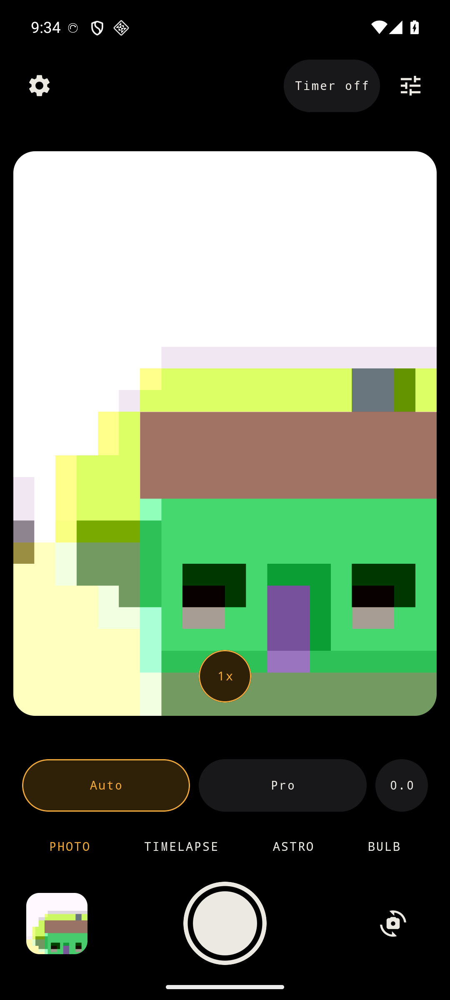
  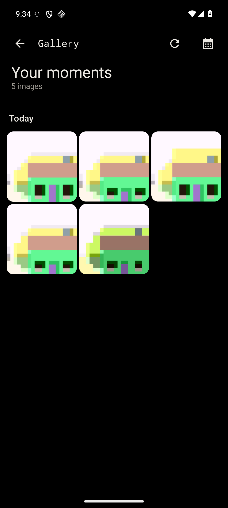
  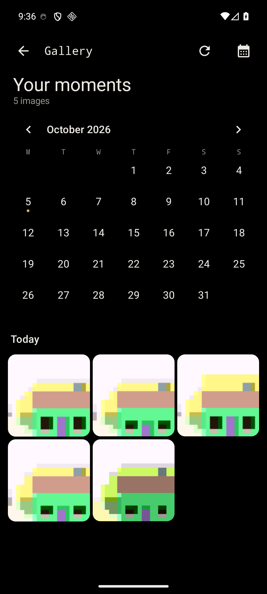
  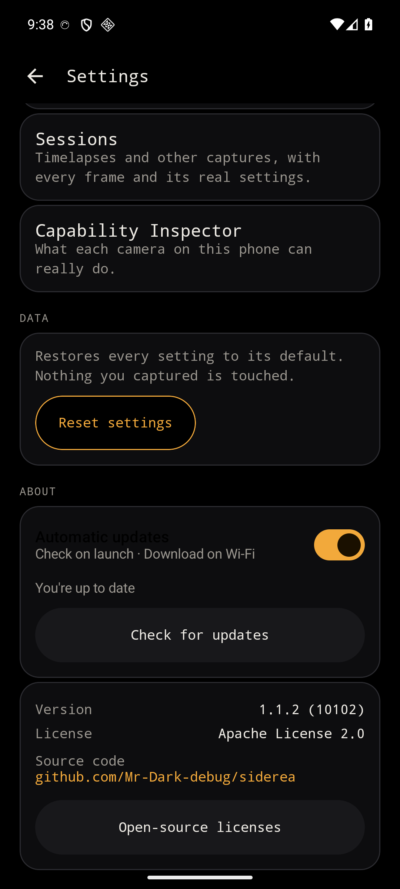
</p>
<p align="center">
  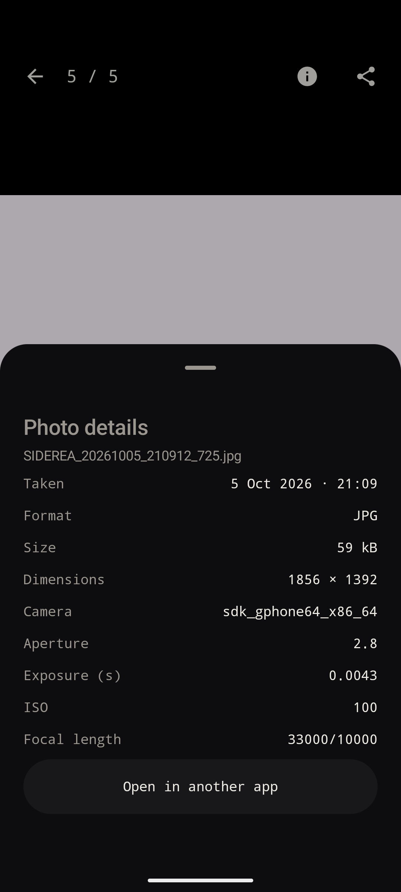
  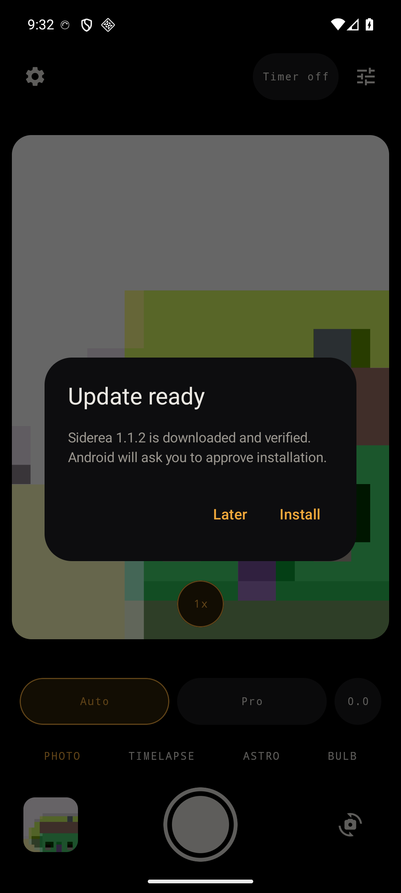
</p>
<p align="center">
  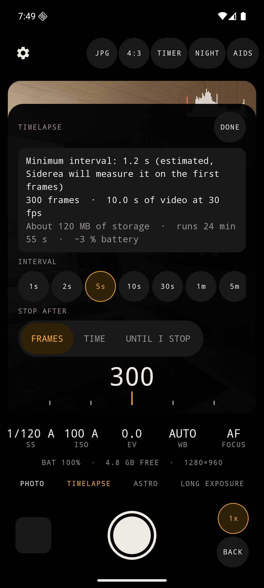
  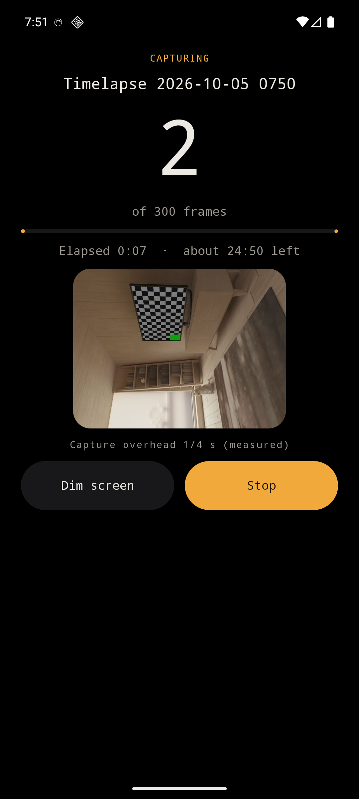
  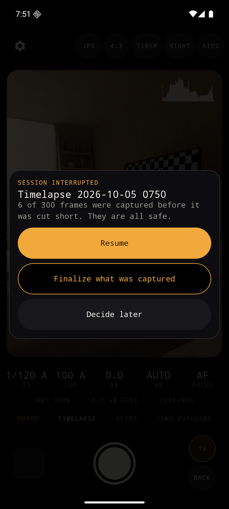
  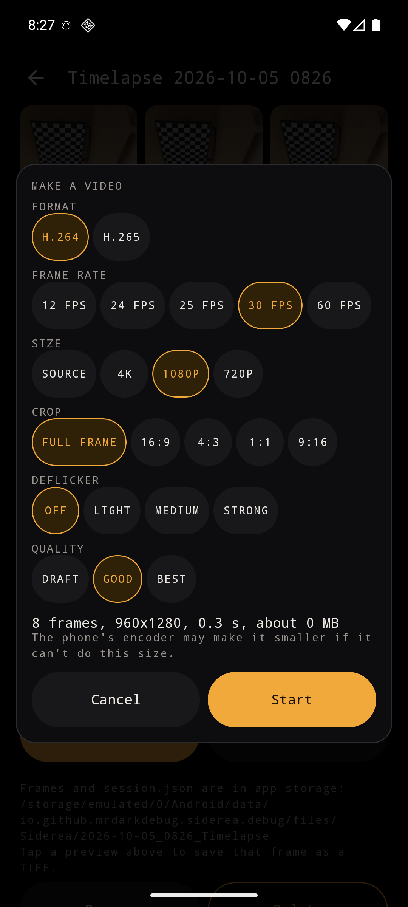
  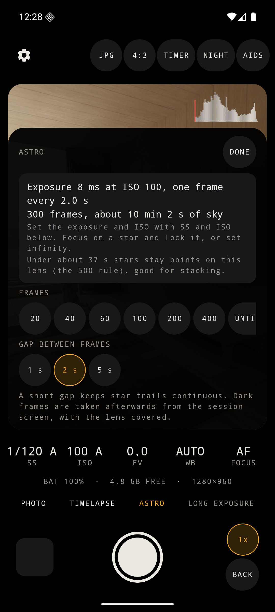
  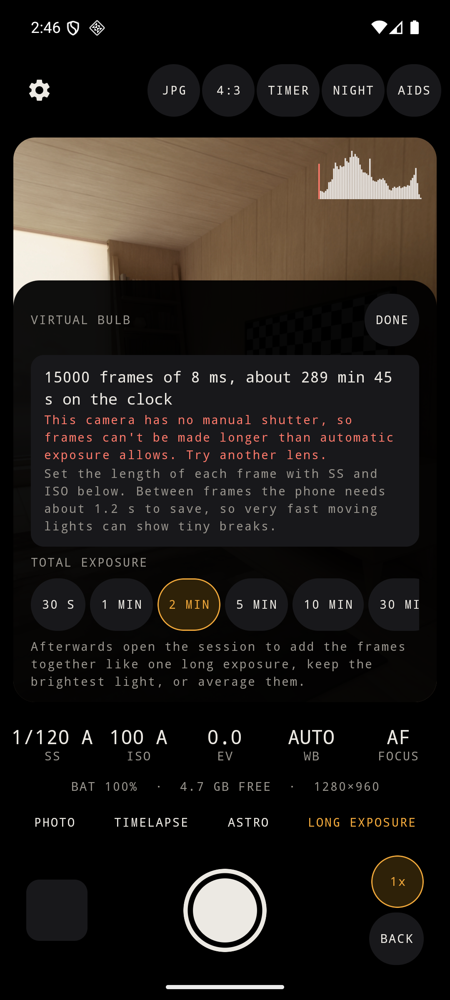
</p>

<sub>Captured on Android emulators. The first six show the v1.1.2 release and update flow using the emulator's moving test pattern;
the remaining screenshots document earlier capture features. Real-device screenshots will replace these.</sub>

## What it does today (v1.1.2)

- **Simpler camera:** Auto and Pro, a larger viewfinder, compact lens selectors and a Tools sheet for
  format, aspect and shooting aids. The shutter and built-in gallery stay one tap away.
- **Built-in gallery:** photos and private session frames grouped by date, a month calendar with capture
  markers, a swipeable/zoomable viewer, real file/capture details and sharing. No broad photo-library permission.
- **GitHub updates:** automatic stable-release checks, unmetered downloads, verified APKs and Android-approved
  installation. See [update and migration notes](docs/UPDATES.md).

- **Manual photo mode** on Camera2: shutter, ISO, focus, white balance (presets or Kelvin + tint) and exposure
  compensation, each with Auto / Manual. Shutter and ISO combine into P / S / I / M behaviour.
- **JPEG, RAW (DNG) and RAW+JPEG**, saved to `Pictures/Siderea`.
- **Only the lenses you really have**, from the camera's own report: on a Pixel 10, back 0.6x / 1x / 5x and front
  0.9x / 1x. Other lenses are driven as physical camera streams.
- **Long exposures** up to the lens's real limit (16 s on a Pixel 10 back camera), with a live preview that keeps
  moving, an exposure progress bar and a stop button.
- **Viewfinder aids:** live histogram with clipping, focus peaking, zebras, grid, a horizon level that also shows
  the camera's altitude for aiming at stars, **night view** (brightens the viewfinder only), self-timer, and
  volume-key / Bluetooth-remote shutter.
- **Timelapse** with a foreground service: interval presets or a ruler, stop by frames / duration / until
  stopped, a calculator (minimum interval from *measured* capture overhead, frames, video length, storage,
  battery), a pre-flight checklist, locked exposure, heat / battery / storage guards, and a screen-dim mode.
  **Exposure ramp** for sunsets and sunrises: shutter first, then ISO, a quarter of a stop per frame at most,
  steered by the brightness of each frame it just took.
- **Astro mode**: back-to-back long exposures (interval = exposure + a short gap, never faster than the phone can
  save a frame), with a "500 rule" hint for the lens. Afterwards from the session screen: **star trails**,
  **comet trails** and an **aligned stack** (stars are detected, matched against a reference frame, and the frames
  are warped onto it and averaged; frames that cannot be matched are left out and listed), plus **dark frames**
  taken with the lens covered and subtracted. Results are a JPEG and a TIFF (16-bit for stacks).
- **Virtual Bulb**: a long exposure built from many short ones, past the lens's single-frame limit. Pick a total
  time (30 s to 1 h) or run until you stop it; the frames are then added like one long exposure (in linear light,
  with a gain that keeps highlights from clipping), merged keeping the brightest light, or averaged.
- **Export** from a session: **video** (H.264 or HEVC, AV1 only where there is a hardware encoder; 12-60 fps;
  4K / 1080p / 720p / source; 16:9, 4:3, 1:1, 9:16 crops; three deflicker strengths; three quality levels, with a
  live size estimate), a **ZIP** of the frames and `session.json`, and any single frame as an uncompressed
  **TIFF**. Results are saved to `Movies/Siderea`, `Pictures/Siderea` or `Download/Siderea` on request, or shared.
- **Sessions:** every capture is a folder with a crash-safe frame journal and `session.json` holding the *actual*
  per-frame values. A session cut short (crash, kill, camera taken) is offered **Resume** or **Finalize** on the
  next launch.
- **Capability Inspector** for every camera, with a plain-language verdict per lens, exportable as JSON.
- **Night-first design**: true black, one amber accent, a pure-red night-vision mode, 56 dp touch targets.

**Accessibility:** the camera screen, every mode panel, the manual-control panels and Settings pass the Android
Accessibility Test Framework (touch-target size, labels, contrast); the ruler dials expose range and set-progress
actions to TalkBack; text follows the system font size (the camera's own readout rows stop growing at 1.25x so
they stay on one line, everything else scales fully).

**Not in 1.0:** stacking from RAW (DNG) frames, sigma-clipped stacking, GPS tagging, live preview of a growing
virtual bulb, translations, and anything that needs a real phone to prove (see the changelog's "untested on a real
device" list).

## Why

The stock Pixel camera hides manual control in night and astro shooting, and its timelapse output can't be
tuned. Video-first apps don't do long-exposure stills or astro timelapses. Nothing offers *full manual camera +
long-exposure intervalometer + astro stacking + proper video export* in one clean Android app. Siderea aims to.

## What it is built around

- **Camera2**, not CameraX: direct control of shutter, ISO, frame duration, focus distance, AE / AF / AWB and
  `RAW_SENSOR`, with per-frame `CaptureResult` metadata.
- **Capability-driven UI.** Nothing is hardcoded. Every range, mode and size is read from the camera, and a
  control a lens can't honour says why ("This lens can't expose longer than 1 s. Use Virtual Bulb for longer
  exposures.").
- **Work around what phones don't offer.** The Pixel 10 has no Android 16 Kelvin/tint control and no hybrid
  auto-exposure, so Siderea computes white balance from the sensor's colour calibration and implements
  shutter-priority and ISO-priority itself.
- **Night-first design.** Dark only, one accent, a red mode that preserves dark adaptation.

## Inspector output from a real Pixel 10 (Android 17)

Collected by the maintainer with Siderea v0.1.0 ([full report](docs/device-reports/google-pixel-10-android-17.json)):

| Lens | Facing | Shutter | ISO | RAW | Manual focus |
|---|---|---|---|---|---|
| 1x (logical camera `0`, main) | back | 1/17554 s – **16 s** | 30 – 7518 | 4000×3000 | yes (nearest focus not reported) |
| 0.6x ultra-wide (physical `3`) | back | 1/86610 s – 16 s | 52 – 5000 | 4208×3120 | no (fixed focus) |
| 5x telephoto (physical `4`) | back | 1/21562 s – 16 s | 48 – 4615 | 3976×2736 | yes |
| 1x (logical `1`) | front | 1/21562 s – 1 s | 45 – 4324 | 3440×2448 | yes |
| 0.9x wide selfie (physical `5`) | front | 1/21201 s – 1 s | 45 – 4324 | 3840×2736 | yes |

What that report decided: the 16 s back-camera limit makes single-frame astro practical; **no** Android 16
Kelvin/tint and **no** hybrid AE on this phone (so Siderea does both itself); the nearest focus distance is
reported as null on every lens (so Siderea assumes 10 cm and learns the real value while autofocusing); and
lenses behind the logical camera must be opened as physical streams to get their own RAW.

## Supported devices

- **Android 10 (API 29) or newer.** Built against and targeting Android 17 (API 37).
- What a phone can do depends on its cameras, not on Siderea. Manual shutter/ISO needs `MANUAL_SENSOR` and RAW
  needs `RAW`; each lens reports them separately and Siderea shows or disables controls per lens.
- Kelvin + tint is used natively when a camera offers the Android 16 controls, and computed otherwise.
- Confirmed from a real device report: **Google Pixel 10 (Android 17)**. More from
  [device reports](#help-wanted-send-a-device-report).

## Install

Grab the APK from the [latest release](https://github.com/Mr-Dark-debug/siderea/releases/latest) and open it on
your phone (allow installs from your browser or file manager when prompted). Verify it against the SHA-256 in
the release notes.

> v1.1.0 and future releases use a **persistent debug key**. The public v1.0.0 used a different key and may need
> a one-time reinstall: export private sessions first. [Update and migration details](docs/UPDATES.md).

## Build from source

Requirements: **JDK 21**, Android SDK with platform `android-37.0`.

```bash
git clone https://github.com/Mr-Dark-debug/siderea.git
cd siderea
./gradlew assembleDebug                      # → app/build/outputs/apk/debug/
./gradlew qualityCheck testDebugUnitTest lint
./gradlew :app:connectedDebugAndroidTest     # needs an emulator or device (a real camera or an AVD)
```

Create `local.properties` with `sdk.dir=/path/to/Android/Sdk` if Gradle can't find the SDK.

## Help wanted: send a device report

1. Install the APK, open the settings (gear) → **Capability Inspector**.
2. Tap **Share report** (or **Copy as JSON**).
3. Open a [Device report](https://github.com/Mr-Dark-debug/siderea/issues/new?template=device_report.yml) issue and
   attach it. It contains your phone model, Android version and camera capabilities, with no photos, location or
   accounts.

Even better: shoot a few frames and report anything that looks wrong, with the report attached.

## Project layout

```
app/                  single-activity app: navigation, Hilt wiring, camera + inspector + settings screens
core/ui               design system (theme, tokens, ruler dial, shutter button, components)
core/camera           Camera2 engine, capability reader, verdicts, colour maths, analysis, JSON report
core/data             settings (DataStore)
core/capture          sessions, intervalometer, service   (M2)
core/processing       stacking, star trails, alignment    (M4)
core/export           video and image export              (M3)
branding/             logo, wordmark, asset generator
docs/                 ARCHITECTURE, DESIGN, TESTING, RELEASING, device reports
```

Read [docs/ARCHITECTURE.md](docs/ARCHITECTURE.md) for the decisions, [docs/DESIGN.md](docs/DESIGN.md) for the
visual language and [docs/TESTING.md](docs/TESTING.md) for automated coverage and the real-device checklist.

## Name

*Siderea* comes from Latin *sidereus*, "of the stars". At the time of choosing, a search of GitHub, the Google
Play Store and the web found no camera or photo app with this name. The nearest names are *Sidereal*, an
astrophotography planning app on Google Play, and `Terryroud/siderea`, an astronomy-education site. Both are
different products with different spellings.

## Contributing

See [CONTRIBUTING.md](CONTRIBUTING.md). Siderea is Apache-2.0; please do not contribute code copied from GPL
camera apps.

## License

[Apache License 2.0](LICENSE). Third-party licences are listed in the app under **Settings → Open-source
licenses**.
